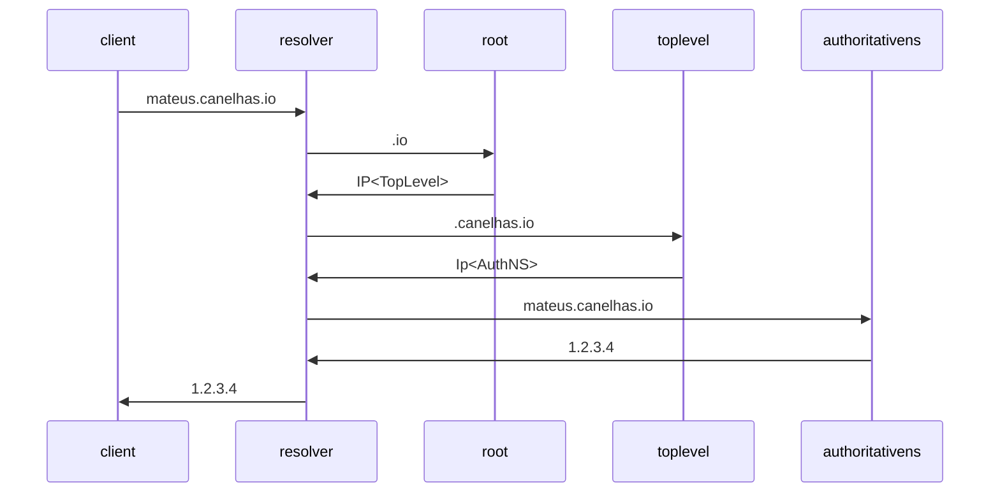

# 2022-04-28

<https://www.youtube.com/watch?v=tgWx81_NGcg>

don't just accept the requirement, go to the root ; push back

(?...)IP Fragmentation

Chrome overloads DNS servers
    . You search omnibar for something
    . This osmething *could* be a domain
    . Chrome doesn't know, so it tries to resolve it
    .

DNS are plain text, until DoH and DoT are more mainstream

___

Think about access
    - Not only credentials, but also *social access*

___
