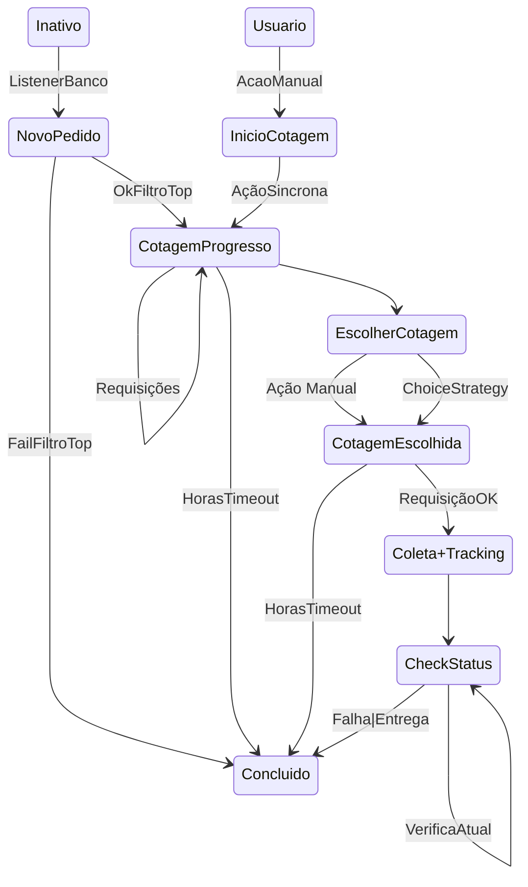
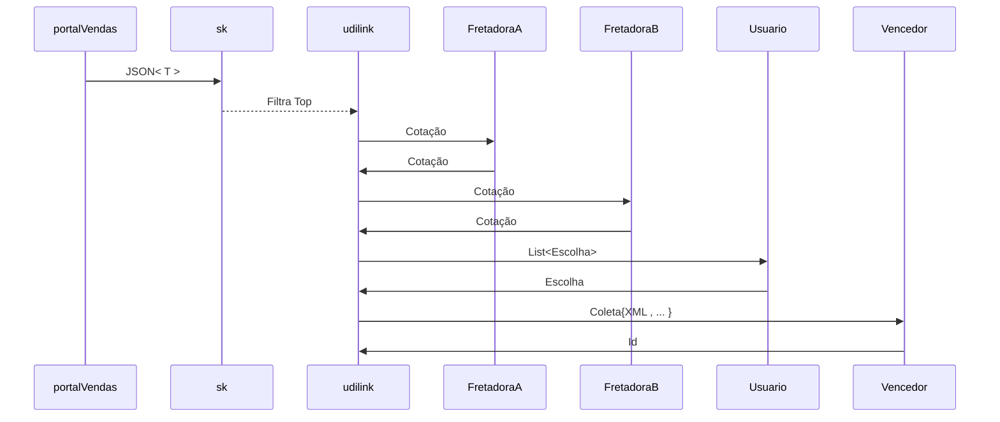

# 2022-06-27

asdasd

```mermaid
stateDiagram
    
    Inativo --> NovoPedido : ListenerBanco
    NovoPedido --> Concluido : FailFiltroTop
    NovoPedido --> CotagemProgresso : OkFiltroTop

    Usuario --> InicioCotagem: AcaoManual
    InicioCotagem --> CotagemProgresso: AçãoSincrona
    CotagemProgresso --> CotagemProgresso: Requisições
    CotagemProgresso --> Concluido:  HorasTimeout
    CotagemProgresso --> EscolherCotagem
    EscolherCotagem  --> CotagemEscolhida : Ação Manual
    EscolherCotagem  --> CotagemEscolhida : ChoiceStrategy
    CotagemEscolhida --> Concluido : HorasTimeout
    CotagemEscolhida --> Coleta+Tracking : RequisiçãoOK
    
    Coleta+Tracking --> CheckStatus
    CheckStatus --> CheckStatus: VerificaAtual
    CheckStatus --> Concluido: Falha|Entrega
```

```mermaid
sequenceDiagram
    portalVendas ->> sk: JSON< T >
    sk -->> udilink: Filtra Top
    udilink ->> FretadoraA: Cotação
    FretadoraA ->> udilink: Cotação
    udilink ->> FretadoraB: Cotação
    FretadoraB ->> udilink: Cotação
    udilink ->> Usuario: List<Escolha>    
    Usuario ->> udilink: Escolha
    udilink ->> Vencedor: Coleta{XML , ... }
    Vencedor ->> udilink: Id
    
```

->
Etiqueta, codigo de rastreio, x
<-
