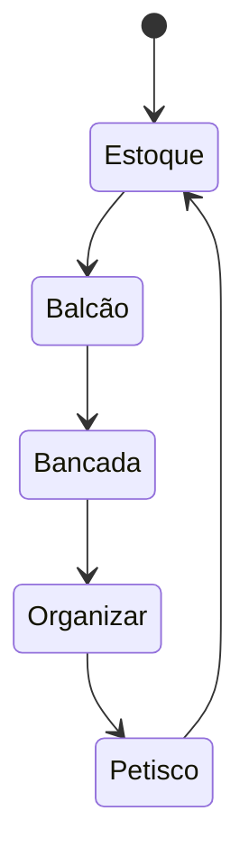

Criação de habito

* Gatilhos
  * "Seja uma boa formiguinha, leve pro estoque uma caixinha -> Pegue um 1 bis"
* Recompensa Imediata
  * "Bis"
* Remoção de barreiras
  * Mentais
  * Emocionais --
  * Fisicas
* Incrementalidade:
  * Bagunça "Interna"
  * Nao precisa fazer tudo agora
  
-> Balcao
-> "Bagunça Interna"
-> "Arrumado Final" -> Petisco

Formalizar esses processos

