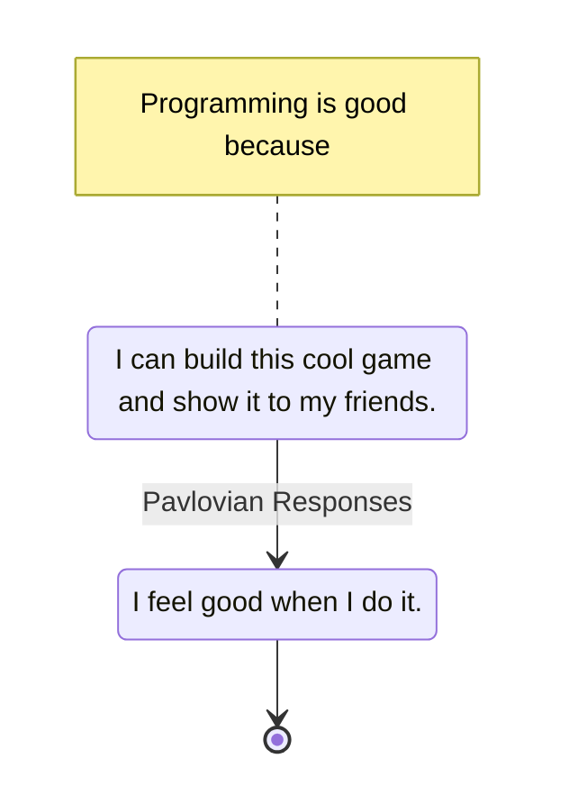

---
tags:
    - psychology
    - fact
---

# ChangeProxyMetrics

[[ProxyMetrics]]

After a few years of doing something very consciously, you build up this great [[RewardSystem]] that makes you feel good about it by itself, but it can take years to retrain.

__The problem is when your ultimate goal changes and your old proxies are still in effect.__

When such a thing happens, it is no longer useful to let your habits drive you. It is necessary to put the rational system on the wheel. [[ThinkingFastAndSlow]]

## References

* [The hardest challenge about becoming a manager · Erik Bernhardsson](https://erikbern.com/2015/06/05/the-hardest-challenge-about-becoming-a-manager.html)
