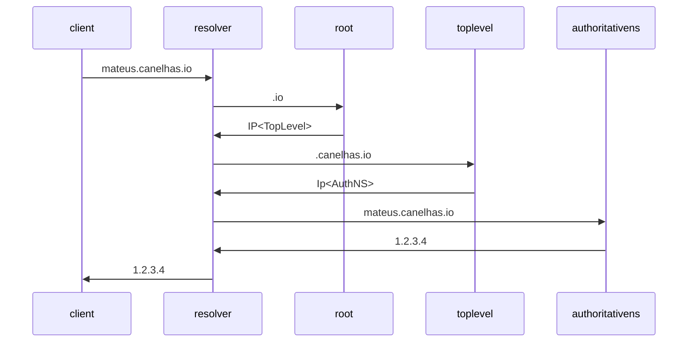

<https://www.youtube.com/watch?v=B5Vw6H3oSD8>

DNS has
    Udp Header
        Source Port
        Destination Port
        Metadata

    DNS Data
        Query Id
        Metadata
        DNS  

tcp half open?
reflection attacks

___

(?...)IP Fragmentation

Chrome overloads DNS servers
*You search omnibar for something
*This something could be a domain
*Chrome doesn't know, so it tries to resolve it

DNS are plain text, until DoH and DoT are more mainstream

___

___

<https://www.youtube.com/watch?v=eNF9z5JNl-A>linked makes use of the layer 6 implementation?

___

DNS
    . Can point to ip:ports via SRV records
