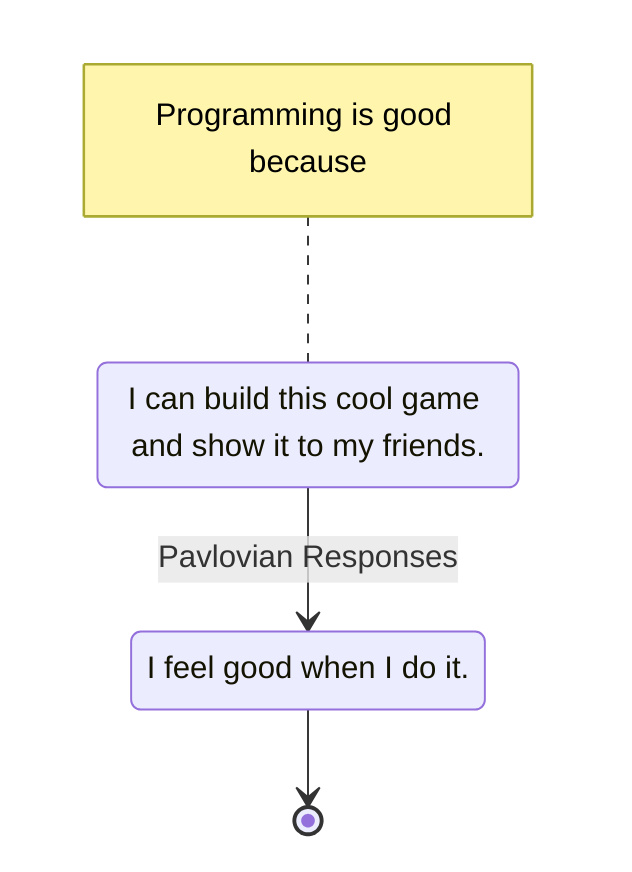

---
tags:
    - optimization
    - psychology
    - thought
---

# OnProxyMetrics

It would be incredibly costly if every action was judged in terms of its benefits amortized over your entire lifetime.

Instead, we humans invent pretty arbitrary proxies, such as getting high scores on exams, or in my case, writing shitloads of code.

Proxies are great because they let you make decisions quicker.

After a few years of doing something very consciously, you build up this great RewardSystem that makes you feel good about it by itself.

__The problem is when your ultimate goal changes and your old proxies are still in effect.__

___

References:

1. <https://erikbern.com/2015/06/05/the-hardest-challenge-about-becoming-a-manager.html>
2. [[ProxyMetrics]]
___

