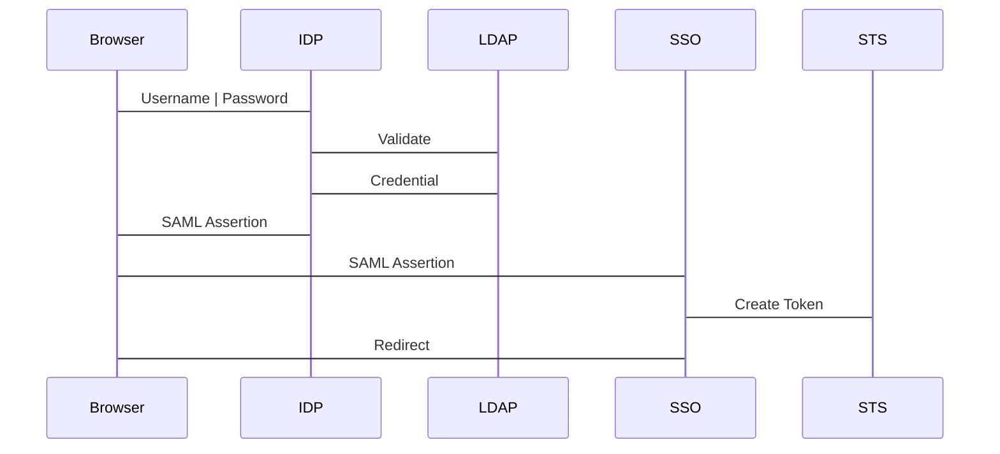

Ops Works
    Stack
    . A set of instances that you want to manage collectivelly, because they have a common purpose. 
    . Handles tasks that apply to the group of instances as a whole, such as manging applications and cookbooks. 
    Layer
        . A component of a stack. 
        . Each layer in a stack must have at least one instance
        . Each instance in a stack must be a member of at least one layer. 
    Recipe
        . ????
    

Ec2
    SPot
        . Discount for unused capacity.
        . Stateuless, fault-tolerant or flexible applications
        . highly integrated with other aws services
    Fargate 
        . Servierless compute engine for containers
        . Works with both ECS and EKS
    ECS
        . Shared state, optimistic ocncurrency system
        .  When launched with the fargate launch type, has its own isolation boundary and does share kernel and resources. 

