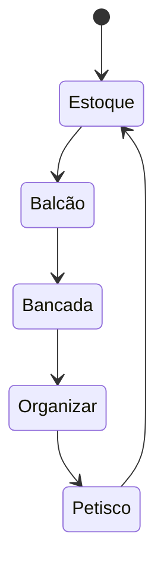

<https://codecraft.co/2012/10/23/on-seps-squirrels-and-meta-questions/>

Innatentional blindness can be a good thing. Being able to zero in on a particular block of code, to the excl usion of the guy sneezing on the next cube is healthyl.

However, superb engineers have a capacity to see through the cloak of somebody else's problem; they think simultaneously o multiple levels of abstraction. They tend to ask "meta questions" that poke at larger issues, broader contexts aand more distant time horizons.

"Seeklcts meta qestions that tes assumptions or uncover misalignments as rapidly as possible"

"Plenty opf problems don't merit deep t hinking. The zen master found time for our example iossue by judiciously ignoring others, even tih iportant issues, you don't have to think at all these levels all the time. just being aware of broader contexts and probing them ocasioanlly will bring benefits to your team.

___

<https://codecraft.co/2012/10/22/unencapsulate-yourself/>

"Organizations that encapsulate people into layers r silos map nicely onto this through experiment. If you want to build a new feature,you ping-pong around to various specialists. Communications by document is the norm. Use cases are written in terms of a horizontal layer; Nobody seems to remember tgat the top of the stack is the entire universe as far as the user is concerned"

"Give me a proactive first class generalist in a siloed org and i will give you a high-leverage change-maker that's a linchpin for company success. They will be invited to every meeting, cut through ambivalence, see the big picture and make smart tradeoff. they'll lubricate the cogs of the machine in a way that an equally smart, but siloed, technical pro cannot."

___

# THoughts

So, the "frustration" comes from not getting an expected result , nor a explicitly positive response

The second one cant be avoided - it is a slip- as you call

But when there is no intent for a result, there is no axis of calibration for success-ness

In the user design analogy, Its the equivalente of pushing buttons randomly for the sake of it

___

For some time now i have this conception of what a "learning" workflow would ideally look like  

Earlier on, i was trying to use other "specialized" apps , such as roam and obsidian, but i kept hitting this barrier of operational friction ;
Had to remap a lot of things, workaround lack of support ; I went to the length of coding an entire plugin to be able to do my shortcuts
(<https://github.com/tgrosinger/leader-hotkeys-obsidian/pull/19>), which was merged yesterday btw.

In summary, this operational friction isn't good, and from my findings, there wouldn't be that much great gains anyway. Any that might exists can be acessed by using the app in a read-only way, while letting the editor do the write-edit heavy part.

With this out of the way, i could focus better on the note-taking content, per se

___

In regards to note-taking, the approach i've settled down on was a incremental one: Every day i create a single new note , with the date. In this note i just write down streams of thought, with very little structure.
When i "feel like it", i just go over these previous day streams, and pick them apart for the good bits. The connections and structured content comes about in only a second moment : this is something that i would consider key.

For the results, i feel like taking a more structured ( but still organic ) approach to learning makes me more mindful of the process.
Being able to spot those 'gems' that come into our minds, which we know are good content but would not otherwise solidify.
The connection-part thing is very interesting also - Seems like i'm always on the lookout for parallels and analogies now , which i consider a good thing.

All in all , its been pretty good, would def recommend.

The key points should be like:
    1 . Overcome the operational friction by incorporating it inside my editors
    2 . Having triggers for doing it
    3 . Don't stressing about immediately producing structured content.

As an exemplification of the above concepts:
    1 .  I'm using foam / dendron inside vscode , so writing and editing feels way easier
    2 . I developed a web page that gets brought whenever i hit a new tab - This page picks 5 random articles from my readlist and displays them to me.
    3 . Having the daily stream of thought file.

Some great things about having a "simple"  workflow is that:
    .  Easily versionable. This gives me a lot of security , knowing that its always backed up somewhere and i can just undo whatever / whenever.
    . Its flexible: I incorporated my read lists into it ( the lists inside the /other folder. ), and since its text, i can interact with it via custom scripts easily. Currently, i'm able to write down basically every page i visit using autohotkeys, and mark it down as read using python. Also using scripts to create the web page.

For a time now, i've been thinking about what would an ideal learning workflow be:
    . I  would have a structured "Knowledge Sources", such as rss feeds and other read lists
    . I would have some kind of way to process and archive the golden nuggets
    . I would have some kind of way to go over these archives, re-learning them. A big issue i had recently was just forgetting things. Feels like for every two things i learn i forgot about another one.

Up until now i was able to structure only the first one. I feel like zettelkasten has been a good way of implementing the second one. I plan to implement some kind of active-recall or spaced-repetition routines to re-learn what i wrote down.
And i kinda get excited about other possibilites - Can i integrate this with technologies such as GPT3, as to have a *very* personal assistant?

___

<https://blog.plover.com/math/se/notation.html>
        . Notation is indeed a very powerful / important and often undervalued concept.
        . It's not sufficient for a system of notation to have a way of expressing every result; it has to be able to express every possible computation.
            .. This seems very profound, but i have yet to fully digest  its meaning
            .. It seems to imply that a result is not simply the value of following its computations
            .. But what are computations, even? Or results. This question arrives even if we're not distinguisuing these two concepts.
            .. Interesting to note that even today we do not have the proper tools to denote every single computation.
            .. Is a computation tied down to a 'Perspective'?  are there ways to convert between 'Pespectives' purelly mecanichally, by meana of transforming their notations?
        . On a tangent, notation is just a form of representing the problem
            .. Relate with domain modeling?

    On Sucess:
        Atlas struggle becomes everyday more real.
        Our real goal and fulfilment doesn't come from reach the summit, but from the pain of rolling the ball. Thus, suffering / struggle not only is necessary to reach our potential, it is the actual goal.

    You're not   stuck in traffic, you're traffic.

___

Talk and Move Slower
Talk Less
Sharpen up Physically
Don't always be available

___

Leadership principles

OwnerShip

* A leader must own the entire lifecycle of their decision
* Feel the pain, brainstorm the solution, get the proper stakeholder buy-in , help build the solution and prove it works now and in the future.

Bias For action

* Ponder the consequences, but not be indecisive

Invent and simplify

* Seek to improve
* push the boundaries of what can be created
* Humble enough to accept their own limitations and adopt solutions from others.
  
___

<https://andersource.dev/2022/04/19/dk-autocorrelation.html>

"For year i thought myself relatively immune to this. Of course, i'm not - All it tookk was the right trigger."

___

Myth of arrival:
    . The myth that we're going to a point of permanence, somehow.

The mere participation in the activities becomes the reward itself.

it is the best approach for reaching the ideal situation whereby we can support ourselves by means of activities we find intrinsically rewarding. :
Many people dream of such a line, but few attain it due to the sole reason most people don't get very good at what they do.

Struggle free life:
    . Not a life the human organism is suited for
    . We're restless creatures - tied by mortal nature - and cannot be tamed by external success
    . Our restless can only be tamed through the continual exertion of effort towards ends we deem worthy.

"We measure ourselves by many standards [ ... ] But deeper than all such things, and able to suffice unto itself without them, is the sense of the amount of effort we can put forth. He who can make none is but a shadow; He who can make much is a hero.
"

<https://www.youtube.com/watch?v=mYcR7Wkq1r8>

____

<https://www.youtube.com/watch?v=Y1ZyWaaCilM>

"
If we wish to escape from a life of passivity, stagnation and mediocrity, we must be willing to attend the 'School of Anxiety' - Has a demonic side that can ruin or life, but also a side that can guide us towards the development of a greater self.
    - Which one shows, depends on a large degree to how we approach the anxiety inducing situation of our life.
  
"

Unlike other creatures, who are ruled by instinct and necessity, we must "contend with our freedom."
    . Choosing among the possible paths, and taking the steps towards actualizing these possibilities leads to self creation - the ultimate task of man.
    .  "Man is a creature who is continually beckoned by possibility, who conceives of possibility, visualizes it, and by creative activity carries it into actuality. "

The trouble is choosing the path.
    . Possibility means "I can" - In a logical system it is convenient enough to say that possibility passes over into actuality. In reality is is not so easy, and an intermediate determinant is necessary. This intermediate determinant is anxiety.
    . Every step is patterned the same.
        .. Envision possibility that could further our self creation
        .. Experience the anxiety that accompanies the process of moving forward into a unpredictable and open ended future, but move forward regardless.

The capacity to bear anxiety is important for the individuals self realization and for his conquest of his environment. Every person experiences continual shocks and threats to his existence, indeed, self-actualization occur only at the price of moving ahead despite such chocks. This indicates the constructive use of anxiety.

"
In refusing to move towards the possibility that makes us anxious, we have made a faustian bargain. We gain some temp comfort in avoiding the challenge and remove the chance for failure.
"

"
Those who refuse to launch at into life must commit partial suicide - We must kill off the side of ourselves that desires self-actualization
"

"
No one is coming ;
to save me ; to make life right for me ; to solve my problems ;
the dream of a rescuer who delivers us leaves us passive and powerless.
"
___

<https://www.youtube.com/watch?v=CP1YOeNnZac>

"
One of the most important therapeutically effective factors if subjecting yourself to the objective judgement of others
"

"
Often those afflicted by anxiety , believe that if they can avoid the things that trigger their symptoms, then a relatively comfortable life is still possible - symptom management, rather than recovery becomes their primary goal.
"

"
Flight from life does not exempt us from the law of age and death. He who tries to wriggle out of the necessity of living winds nothing and only burdens himself with a constant foretaste of aging and dying, which must appear especially cruel on account of the total emptiness and meaningless of his life
"

"
What direction the patient's life should take in the future is not ours to judge; It is better to renounce any attempt to give direction and simply to try to throw into relief everything that the analysis brings to light , so that the patient can see it clearly and be able to draw suitable conclusions.

Anything he has not acquired himself he will not believe in the long run, and what he takes over from authority merely keeps him infantile. He should rather be put in the position to take his own life in hand.
"

"
There are many neurotics whose inner decency prevents them from being at one with present-day mo reality and who cannot adapt themselves so long as the moral code has gaps in it which is of the crying need of our age to fill.

They aren't ill because they haven't found a way to live live everyone else ; but because they have not yet found a new form for their finest aspirations ;
Some are born and destined to be bearers of new cultural ideals ; they are neurotic as long as they bow down before authority and refuse the freedom to which they are destined
"

Not everyone is in this category, however .

___

<https://www.youtube.com/watch?v=tIoJhqnOc0M>
"
The shadow,m when it is realized, is he source of renewal ; when there is an impasse, and sterile time in our lives, despite an adequate ego development - we must look to the dark, hitherto unacceptable side which has been at our conscious disposal
"

"
awaken to the troubling idea that our portion of or personality is add odds with current morality and  with our family , peers and society judge as good and evil
"

"

Examine the morality we have been grow into;
its not that we must turn evil in the sense of turning criminal ; but in the sense of detaching ourselves from the flaws of our moral code so we can reconnect with the parts of our personality we lost to our shadow long ago.

This is not only normal, but essential; The achievement of independence involves the capacity of the ego not only to adopt the values of the collective but also to secure the fulfillment of those needs of the individual which run counter to collective values - and this entails doing evil.

By not being aware of having a shadow, you declare a part of your personality to be non-existent. If you get rid of qualities you don't like by denying them, you become more and more unaware of what you are, declaring yourself more and more non-existing and your devils will grow fatter and fatter.

First, one has to accept and take seriously the existence of the shadow. Second, one has to become aware of its qualities and intentions . This happens through conscientious attention to moods, fantasies and impulses. Third, a long process of negotiation is unavoidable
"

"
Do we experience a simmering anger for no apparent reason ?
Maybe we have recurrent fantasies, born from resentment, bitterness, self-hate ; Desire for destruction and revenge ;
In these cases, it is likely that we have not integrated our aggression into our conscientious personality;
to initiate such process, we can seek safe, controlled and productive outlets within we can act with more aggresion ( sport, martial arts , more assertive of our behaviours, inclined to stand our ground)
"

___

<https://www.youtube.com/watch?v=gfyCzLbcAvk>

Most indivividuals, fearing the complex depths within, remain at the superficial and surfacer layer of their psyche ; industriouly mindful of their common comedy and not at of themselves

"What he wanted was totality ; he disciplined himself to wholeness, he created himelf. ~~ about Goethe"

"
the beast within
just as a raging river can be harnessed for its energy, so can the uncivilized layers of the psyche, if handled and channeled properly, can revitalize life.
"

"The mind as multiplicity - an aggregation of intertwined psychological entities

the most general picture of our essence is an association of drives ,with constant rivalry and particular alliances with each other.
"
like a city - numnerous conflicting subpersonalityies simultaneously live. how to harmonize the abundance of drives and impulses, and provide coordination between them? ->
    Organizing idea ; A dominant master drive thast forms the living entre of the psyche, and co-opts all the other drives to act in subordination to its idea
    ~ Is this an daemonic?

"
There is a false saying: How can someone who can't save himself save others?
Supposing i have the keys to your chains, why should your lock and my lock be the same?
"

___

The crisis of meaning (  Jung )
    . The general neurosis of our times
    . The lack of meaning is a soul-sickness whose full extent and import out age has not yet began to comprehend

 Viktor Frankl
    . Ever more people have the means to live, but no meaning to live for

happiness is about the present moment, independentof other moments, whereas meaning links events across time, thus integrating past, present, and future ( IAIN McGilchrist)

How can we discover a meaningful life message
    . tap into the wisdom  of the old mythos
    . what is the use of a religion withtout a mythos, since religion means, if anything at all, precisely that function which linkws us bgack to the eternal myth?

    . contains truthes about the human predicament and the nature of psyche expressed in narrative form. 

    both logos and mythos are realms to discovering truthts, but their truths are of a different nature
        . logos teaches us how to cure a sickness
        . mythos teaches us how to cope with loss and death

"
Is not jesus a prototype of those who, trusting their inner experience, have gone their individual ways in defiance of the world?
"

___

Learning to learn

what can you do when you can't figure something out?
    . learning how the brain works can helps

Brain Modes of Operation ( pinball analogy )

* Focused
* Diffused

Salvador Dali and Edson techniques for accessing diffused mode:
    . holding a metal can and sitting down , letting the mind go. When he fell asleep, the can would drop, producing sound and immediately waking him up.

___

<https://www.youtube.com/watch?v=uxykI30fS54>

The Trugh about a city's aspirations isn't found on its vision, its found on its budget

___

<https://www.youtube.com/watch?v=qT3x9FqcR-U>

cheemz mindset

___

Framing is a way of labeling something that changes how you feel about it, wityhout chaning the thing itself

___

People learn differently.
Some of these learn by taking responsability - regardless of their learning method.
When this group of people are misguided, this behaviour goes out of its way.  - Their specialty turns into absorbing all the responsibility around them while leaving none for others , which results in self blaming in case of failures - While in the learning cone, they enter the blame spiral.

At the beggining of that spiral, their behaviours look good from the outside, and they get positive feedback for their responsible and accountable behaviour - This becomes a positive reinforcer for the blame spiral to grow. However, as it grows unmanagedly , they start to impact others. The blame absorber's spiral touches other people's learning cones and blocks them.

Moving back is possible - But one needs to be aware of the behaviour.
Developing midfullness is a difficult journey :: Marshal B. Rosenberfg's say to take responsibility for our feelings, not for every task.

"What other do may be the stimulus of our egelings but not the cause. When receiving a negative message we can

* We can blame ourservles ( blame absorbing )
* We can blame others
* We can sense our own feelings and needs
* We can sense others lfeelings and needs

The more we are able to connect our feelings to our own needs, the easier it is for others to respond compassionately.
The framework rosen berg uses is connecting the feeling with the need by using a sentence:
"
I feel .... because i Need ... "

This enables the self blame to turn into an action item and fulfill the need of a blame absorber without getting them into the blame spiral.

___

 think a lot of people's introduction to OKRs is John Doerr's book "Measure What Matters". That's where I learned about them.
The book explains how Andy Grove introduced the practice at Intel and it was very effective. The book seems to attribute the success to the practice itself and seems to say "if you adopt OKRs, you will succeed like Intel did".

I suspect that this success is misattributed. I suspect that Andy Grove was probably an excellent manager and I think he could have succeeded with something other than OKRs. I think he understood that what was really important was to get everybody across the organization to focus on essentially one big goal. He needed to make sure that everybody was pulling in the same direction and together, and OKRs provided a tool to do that.

When my organization decided to implement OKRs, my question to my peers was "who is our Andy Grove?"

If the people implementing OKRs focus too much on the practice and not enough on the motivation, I think you just end up with cargo-culting. The setting and tracking of KRs becomes the objective. So people treat it like busywork because OKRs don't really seem to matter - they just gets in the way of the "important" stuff.

As one of my coworkers says, the title of the book is "Measure What Matters", but it's too easy to slide into "What Is Measured Is What Matters".

...

Very true.

However -- note that the process of implementing OKRs has caused the leadership team to write down their expectations, which previously might have been unspoken. This is a first step towards resolving the problem. The next step is for the CTO to push back, hard, on the bits of these that aren't actually realistic, and hopefully get the leadership team aligned on what can actually be done. And so, the process of OKRs potentially has value here in flushing out unrealistic or mismatched expectations between different parts of the org.

This is one of those rare "my way or the high way" moments in leadership; as CTO at this company it's your job to either get the leadership team to realize that they are asking you for more than you can be expected to deliver, or quit. You can't stick around and put your name on a plan that you know is impossible; otherwise you're going to be the one that failed for every quarter to come. And even worse, you can't sign your team up for this BS. It's your job to shield them from this kind of shit.

> Half the Objectives were outside the scope of the engineering team.

Shared OKRs are difficult, but sometimes they are unavoidable. The most difficult business problems usually are cross-functional. At their best, OKRs can help to make these cross-functional dependencies more explicit, and foster communication and collaboration around them.

If they are trying to have engineering take full ownership of a shared OKR, that's a big problem. But if you clearly call out the shared ownership, and consider both parties responsible for implementation, then I think that's OK.

> We were to going to increase our release cadence 10x. We were also going to reduce production issues by 100%. That's right, our objective was 0 production issues whilst massively increasing our release cadence with 0 extra resources.

As a tangential point, increasing release cadence can definitely decrease your long-term rate of issues (see "Continuous Delivery" by Humble[1]) -- this forces you to automate manual processes, and manual processes are one of the main places that errors creep in. Though I think "count of issues" is a very poor metric, you're better off with an uptime metric. And "100%" is the only strictly-incorrect number to pick for uptime, because it is literally impossible; my (super-unscientific, don't hold me to this) rule of thumb for business people is "every extra 9 costs you 10x". So do you need 99.9% uptime or 99.99%?

___

The atomic unit of developer productivity ought then to be one iteration of the inner loop. The appropriate unit is not code quantity, but iteration frequency. We might call this unit of quantity developer hertz.

___

calligaris

porque -> como

como experienciar momentos de tristeza -> edaí? -> de fato perspassa por esse viés de afetividade -> certo, mas é satisfatório

como se sente esgotado frente a situação de não experienciar uma situação afetiva ou emocional?
como que o mateus se sente frente as possibilidades do futuro

não é a régua do outro

as cordas não são o cone.
quais poderiam ser as cordas (pensando que uma corda poderia ser pra você qualquer coisa que teriam minimamente um volume)

mapa mental ->

não avaliar desejos, avaliar processos pelos quais acontecem ou não acontecem

como essas experiencias (lutas vs jogos) aconteceram pra mim?

    -> uma eu penso em prazer
    -> na outra não

            -> Objetivos
            -> Expectativas
            -> Percepção

Ter expectativas maiores com relação aos jogos me faz construir objetivos mais especificos
    -> Significação mínima

Pontuar vontades mínimas e o desencadeamento delas
    -> "algo relacionado a videogames se aproximou de uma vontade" -> "como perceber que isso se configura como uma vontade?"
    "a competetividade me levava a tentar ser o melhor entre meus amigos"
    "isso me levou a dedicar ais temp jogando, comprar mais jogos, trocar deia com pessoas que jogava, coisas que podem ter sido mobilizadas a partir desse desejo"

     We Need To Talk boook

eu tenho essa percepçao racional (parcialidade de responsabilidade)
    -> tão enraizado que percepções sempre perspassam pelo critério de exclusão
    -> (empatia reflexiva)

    -> am imnha observação diz respeito ao lugar que eu ocupo e da minha experiencia em primeiro plano e não necessariamente eu preciso ter vivido essa experiência

    ->

o exemplo do cara dos 4 elementos
    -> pensando nas relações interpessoais, do que tudo pode ser composto? indepentende de relativização, percepções, etc...
        -> "relações interpessoais" : psicologia -> O que causam movimentação possíveis nessas relações.

    -> perguntar da braba

experiencias fisicas satisfatorias (que perspassa pelo outro)

porque não ?
    -> substituir porque porque nao?

a braba é : existe um componente de desejo (de alguma forma)
fato de continuar fazendo terapia?

___

* Ho to deal with archival in GnoSys?
* What is the difference between full article and siplified article in feedly web clipper
* Archival  > Indexing > Remembrance ( Gnosys )

residential app
faster way to develop (remote? inside docker? hot reload)
SETAR ESPAÇO DE CRIATIVIDADE
unidades logicas vs unidades funcionais

___

Self Licensing
    . Happens when people allow themselves to indulge after doing something positive at first.
    . Eg. Drinking a diet soda -> then greasy hamburger.

___

<https://eugeneyan.com/writing/reading-note-taking-writing/>

“Writing is not what follows research, learning, or studying. It is the medium of all this work” - How to Take Smart Notes (Sönke Ahrens)

"Read with the intention to write; What are the open ideas for exploration?"

"Writing is not the outcome of thinking. It __IS__ thinking. "

____

20 hours tu break the frustration barriers
Outliers by gladwell: 10k hours until expert
Great people get at most 3 qnd a half hours of deliberate practice a day

What about "capacity" instead of "expertise"?
20 hours of rápid skill acquisition

Deconstuction
Lean each subskill
Remove barriers ( physical, emocional)
Practice the important subskills

Desire for instante gratificação is what keep us from learning

15 years in 1 month
Academic learning and cred3ntialing has little tô do with rapid skill acquisition

Language acquisition is different from language learning:

The monitor hypothesis:

Running vs a maraton  == learning vs training

Certification are often at odds with learning
Practice in context
Mindset the new... os success
Fixed mindset vs growth mindset

Three stage model
Cognitive or early- understanding
Associative or mid
The autonomous

10 principles
Cultivate a temporary obsession

1 choose a loveable project
2 Focus on 1hours skill at a time
3 Define a target performance level
4 Deconstruct subskill
5 Obtain critical tools
6 Eleminitae barriers tô practice
7 Define dedicated time
8 Create Fast feedback loops
9 Practice by the clock in short bursts
10 Empathize quantity and speed

Carl popper on loveable problems

A problem well stated is a problem half solved

What tools,  components and environments do you need to practice efficiently?

Identify low value blocks of time and cut them

Pre commit into investing 20hours hours or choose another skill to acquire

Autohotkeys pomodoro : 3 or 4 practice sections

Power law of practice

In general,  immersion works- you cant walk away from the early training - but dont count on it

___

Criação de habito

* Gatilhos
  * "Seja uma boa formiguinha, leve pro estoque uma caixinha -> Pegue um 1 bis"
* Recompensa Imediata
  * "Bis"
* Remoção de barreiras
  * Mentais
  * Emocionais --
  * Fisicas
* Incrementalidade:
  * Bagunça "Interna"
  * Nao precisa fazer tudo agora
  
-> Balcao
-> "Bagunça Interna"
-> "Arrumado Final" -> Petisco

Formalizar esses processos

