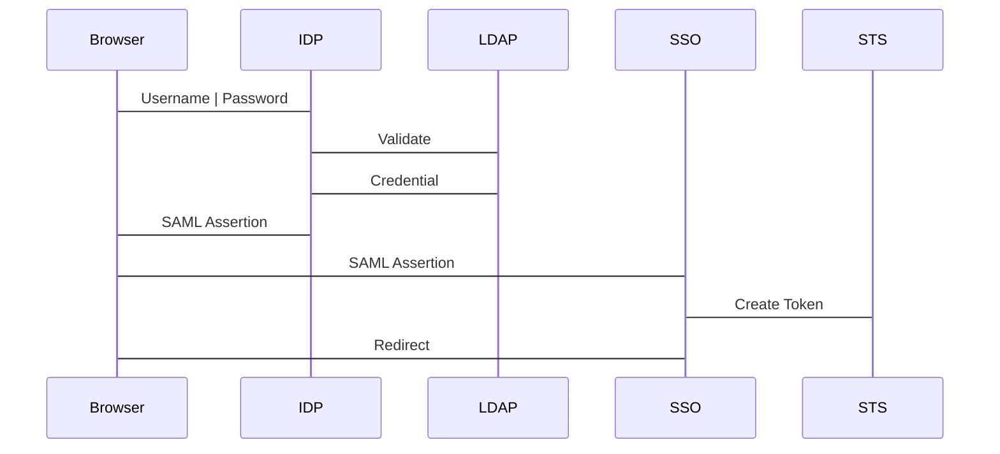

IAM

Manage the access to the different resources and services in a secure manner
Integrates to all services

Principals and Entities
	Principals: Person / application who can call for an action or operation in a resource
		. It is authenticated as a root user or an IAM Entity

	IAM Entity
		 . User / Roles

	Do not use Root Credentials for daily works

	IAM Policies:
		Whether to allow or deny request to an resource

	Provides MFA Authentication

	Policy Simulator
		: Test the resource policies before applying
		Also troubleshooots after being applied

Best Practices:
	
	Don't use the root account. 
		Lock away account root / access keys

		Create Individuals USers
		Configure strong passwords,
		Rotate Credentials Regularly
		Remove unnecessary credentials,
		enable MFA
		Use groups to assign permissions to iam users

		Use Define Policiies to Assign Permissions wheenever pssobile 
			Least Privileges
		Use policy condigtions for extra security

		Use acces levels to review iam permissions
		Monitor activity in the accounts.

Practice by creating complex settings.

___

Integrating with other identity providers

	Integrating wiht Microsoft Active Directory

	SAML Federation
		.. Security SAssertion Markul Language

	
	Steps
		. Need a Active Directorive Federion Service in the On-Premise networks
		. Then create a saml provider in aws
		. Then need to add AWS as the trusted erlying party in the ADFS 
		. Then configure clamins on your on-premise ADFS to accept incoming requests from aws and map it in the active directory groups

		. AWS ROLES ARE MAPPED TO ACTIVE DIRECTORY GROUPS !

Using a Directory Service

 ....

___

IAM ROLES
	
	. IAM roles plays part in designing and securing any application.

	. For interactions between services.

	. Whenever any entities , such as a lambda function, or a user, or a ec2 instances tries to assume a role:
		.. sts::assumeRole
		. Every role has a trusted relationship policy
			.. If the entity isn't there, the entity can't assume that role.

		. Once this action is perform, it will generate temporary credentials
			.. AccessKey
			.. SecretAccessKey
			.. SessionToken
			-> Having these 3, its the same as having a user.
			-> By default, it expires 1h
				( configured between 15m to 12h)
				.. The request fails if outside the allowed range.

		. Ec2 instance using ec2 role to upload a doc to s3:
			this happens under the hood.
			Important to know how these credentials are generated:

		. When using federated access, need to use the dsks.

		IAM Have a trust relationship -> defines which service can assume the role
		Roles can have am policy attached, to define which services can be accessed by the roles temporary credentials

	. Types of role:
		AWS Service role.
			Role tahat services assume to perform actions in your account on your behalf.
			Access only within your account, cannot grant to someone outside the account
		AWS Cross Account Role
			This allows other accounts to work
		AWS Service-linked Role
			Predefined by the servvices and includes all the permissions that the service requesers to call other aws services on your behalf
		Web Identity Roles
			. A role that allows users federated by the specified external web identity or OPENID Connect provider to assume this rle to perform actions in your account.
		SAML 2.0 Federation Role
			. Same, but for SAML.

	. Best Practices

		Root Accounts
			.. When creating a account, the email used to create becomes the root user. This becomes super user.
			.. Don't use the root account day-to-day: Create Individual IAM Users, or User IAM Groups, and assign the right policies.

			Avoid Root User access keys. Ensure to use the console password if need to login
			Use a Strong password.
			Don't relay the root user account
			Enable MFA for the root account.
		IAM Users and groups
			.. Create separate users
			.. groups users into groups and assign permissions
			.. create stron passwords 
			.. enable MFA
			.. Rotate credentials
			.. Apply password policies
			.. Remove unnecessary credentials
			.. Grant least privilege
			.. You can use the cloudtrail or the user advisor to see what are the actions being performed by users. Use that to grant the required privileges.
			.. Use IAM Roles for apps that use in ec2 instances
			.. Use monitoring Tools
				.. AWS CloudTrail, AWS Config.

___

IAM users are global.

...

....

You can further secure the assume role with an ExternalId, that is not available in the console.

...
...

On ROles
https://docs.aws.amazon.com/IAM/latest/UserGuide/id_roles.html

...

IAM Roles allow least priviledged access , giving temporary credentials.

___

Security Across Multiple Accounts
	
	Single account
		. IAM
			. Users 
			. Permissions
		. Management and Governance
			. Amazon CloudWatch
			. AWS Config
			. AWS Organization
			. AWS CloudTrail

	Centrailized secuity accounts 	

		. Send Logs to security accounts
		. Limited set of users
		. No hability to delete the logs 

___

Cross Account Access

	Providing acess across accounts.

	Create IAM Role
		-> Allows cross account number
		-> Would use the account number of the 'guest'.

	Inside the Guest account:
		-> Create an inline policy that would allow the user to assume the role.

		-> User in an Another account can Assume that role.

___

In order to remove a member account from an organization , 
    .. Enable IAM user access to billing in the member account
    .. Make sure it has the required information to operate as a standaolne account.

    . IAM
        .. Identity Access Management.
        .. Authentication, Authorization, and Accountability

        .. Users
            ... Is a person, who will receive access to specific resources.
        .. Principal
            ... An IAM entity who has access
        .. Root
            ... The main user created with the account
        .. Group
            ... Means to create a policy for a certain set of people.
        .. Roles
            ... Almost always, is a system ( service account ).
            ... Can be assumed by others systems and persons
            ... Short term credentials
            ... Can be Cross-Account / Federated.
                :> Be the most granular possible.

        .. Tokens
            ... Temporary. from 6 minutes to 36 hours
            ... Longer duration means better performance, but lower security.
            ...  

        .. Single Sign On
            ... Auth to multiple places using a single set of credentials

___

.. Cognito
            ... Synchronize Identity management
            ... Can use Facebook or google, etc
            ... Can use with guest accounts as well
            ... Use Logs into Identity provider, which returns a Session Key. Application sends a getId, and cognitio validates it. If irs valid, cognito returns a unique identifier. Sending it , it will be validated against the ;

        .. AWS Directory Service ( Managed AD. )

        .. Authentication
            ... User name and Password
            ... Access Key ( usually via API )
            ... Access Key + Session Token
        .. Authorization
            ... Policies ( User, Groups , Roles )
                :> THey have an implicit deny. 
                :> What is the best way to do it? 
                :> AWS has some good managed policies
                    ::> Provides some 'pre-set' common use cases.
                :> Can create your own policies
                    ::> Copy and tune a pre-existing
                    ::> Policy Generator
                    ::>  

AWS COGNITO

	Provides authentication and authorization for web and moible app

	Identity Provider , define users, allow users to perform actions
	Users can sign in with a user name and paswword or via third party such as google and facebook,
	Create user pools or identity pools.

	User Pools:
		. Service automatically provides signup and signin services
		. Users buildtin UI for sign in
		. User other signin providers
		. Directory management and user profile management
		. Enable MFA

___

Cognito : Identity Pools vs User pools

...

...

https://aws.amazon.com/identity/federation/
Identity Federation is a system of trust between two parties for the purpose of authenticating users and conveying information needed to authorize their access to resources. In this system, an identity provider is responsible for user authentication, and a service provider controls access to resources. By agreement and configutarion the SP trusts the IdP to authenticate users . After authenticating a user, the idp sends the sp a message ( called an ssertion ) containing the uyser's sign-in name and other attributes that the SP needs to stablish a session with the user and to determine the scope of resource access that the SP should grant. 

...
