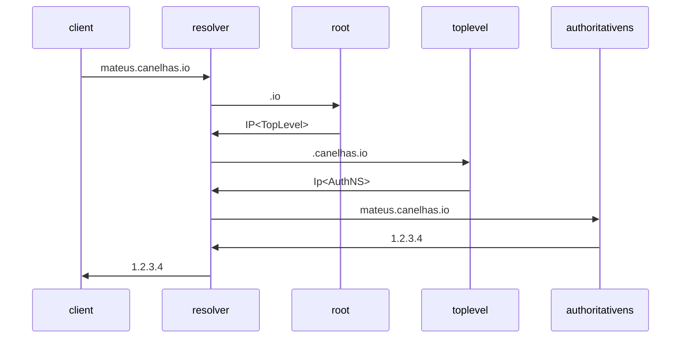

Port forward

Can be done in the router.
    . Ugly,

iptables

nat

transparent proxying

why don't we just run the app in port 80?
    . ports 0 to 1024, these are system ports,
    . cant listen on then unless root
        -> Security concerns.

insert rows in the nat table.
    . "please forward to me , on this other port"
    . uses iptables -> System call , need sudo
        -> sudo iptables -t nat -A PREROUTING -p tcp --dport 80 -j DNAT --to-destination 192.168.254.47:8080

    |> needs to be a ip, cant be dns
when routing to another machine, we need to use maskarade
    . sudo iptables -t nat -A postrouting -p tcp --dport 80 -j MASQUERADE --to-destination ....

these are session only. to persist,  need to use apt-get install iptables-persistent

clearing
    sudo iptables -t nat -F

#

your router is the one who has the public ip address
    . How does it knows to forward the requests?

    . There are many, for example
        .. Port Forwarding

Port Forward is a table configured inside the router, which allows it to forward the requests
    . However, your ip must be static , because the ip in the table is static.

#

Network Address Translation

    Maps a ip address to another ip address
        ( or a ip_address:port pair to another one )
    
    Originally designed to solve the only 4bi ipv4 devices

    not only application
        . 

    

    devices inside the same network can communicate directly by finding each other mac addresses using arp

check if its in the same subnet, does an arp request
else, it calls its default gateway
    when rounting a request, the router will:
        check if its an unroutable ip addresses.

if
router vs switches?

can use to do more things
    . Instead of having root access to listen on port 80.

    . load balancing: takes the packets coming, and create a virtual ip addresses ( VIP ). the vip gets an entry in the nat table  

DNS
    . Can point to ip:ports via SRV records

#

ARP

Maps Ip addreses to mac addresses

Why?

        we need mac to send frames ( layer 2 )

        Most of the time, we know the ip address , but not the mac. 
        
        this process is expensive, so its cached locally, in an ARP table 

Network Frames

    encapsules the ip packet

    
    
    what if the target ip address does not fall inside the local network?

    in this case , the application sends an arp request looking for a default gateway. then, it builds the network frame and sends it. 

#

Osi model

open system interconnections

layer 7 applicatoin
layer 6 presentatoin -> Encrypt if necessary
layer 5 Session -> Establish session ; tag it.
Layer 4 Transport -> Add ports/seq ; Break into segments;
Layer 3 Network -> Adds IP ; Now, called a packet.
Layer 2 Data Link -> Breaks packets and adds the Target Mac ADdresses  ; Now Called Frames, have basic error detection
Layer 1 Physical -> Tranforms into 1 and 0, into electric / optical / radio waves

frames are fixed size
frames are received by everyone in the same broadcast domain, but the network card just discards it ( unless its a broadcast or multicase addressed) . It can be configured to not do so, and forward every packet: This is called promiscuous mode.

where does the tcp buffer enter her?? [[expand]]

#

TCP Tunneling is the proccess of encapsulating content from a protocol A to a protocol B , usually because A is unnavailably.

    .. Isn't this just IPSEC?
    .. Or proxying 

Applications

    Local port forwarding tunnel
    Reverse Port Forwarding tunnel
    SOCKS proxy ( dynamic port )

This can cause TCP meltdown ( tcp over tcp )
    tcp isn't a lightweight protocol
        congestion control, retransmission, garantee delivered, checksumming,
    doing a tcd inside a tcp inside a tcp ... can slowdown everything

___

Similarly one may ask, what is loopback used for?

1 Answer. The loopback device is a special, virtual network interface that your computer uses to communicate with itself. It is used mainly for diagnostics and troubleshooting, and to connect to servers running on the local machine.

is not sent through a real network interface , even if sent to an address on one of the machine network adapters;

windows does not implement a network loopback interface ;

SSDP is a zero-configuration networking protocol designed to allow nodes to be added and removed from a network without any involvement from a central service such as DNS or by assigning static IP addresses to specific nodes. This decentralised, dynamic approach is possible because SSDP uses UDP as it's underlying transportation protocol which allows for multicast communication.

PSH Flag in TCP
The Push flag usually means that data has been sent whilst overriding an in-built TCP efficiency delay, such as Nagle’s Algorithm or Delayed Acknowledgements.

These delays make TCP networking more efficient at the cost of some latency (usually around a few tens of milliseconds). A latency-sensitive application does not want to wait around for TCP’s efficiency delays so the application will usually disable them, causing data to be sent as quickly as possible with a Push flag set.

tcp buffers?

__

ICMP and IGMP are both used for multicast management
IGMP for ipv4, and ICMP for ipv6

IGMP Messages:

General Memeberip queries
Group specific queries
groupo and source specific queires
membership reports

leave group messages

This was sent to 224.0.0.252. Why?
    . 224.0.0.22, and 224.0.0.241 are in my arp table.
    d. 239.244.255.250 is also.
    . 224.0.0.22 does not go away when flushing my arp tables.
    . It is also the one i semd my first IGMPv3 too.
    what is an inet_address?

#

In DHCP, i was the one requesting the address. Why? Is this always the case? How do i know that i correctly received that ip address?
    Where is the parameter request response?
        . Now that i flushed my caches, the responses came in a following ack request.
            .. Later i'll try again without flushing.
    Is the destination always 255.255.255.255?
    It seems that the client is the one that initiates a ip proposal. Is it the case? Can the server reject it?

    It seems that dhcpv6 does things similarly. However, it sends to ff02::1:2
    
    It seems that following the dhcp request, our pc asks over the broadcast "Who is 192.168.1.1 - the router / domain name server / dhcp server"

After this is complete, it seems we start to contact via IGMP and ICMP.
    . It sends IGMP to 224.0.0.22 , which is the entry that wasn't flushed with arp -d.
        .. It starts with a report / join group for any sources ( 224.0.0.252 and 224.0.0.251)
    then a leave group
    . It also Sends ICMP to ff02::16

    In ICMP, the first request was sent to ff02::16 - A multicast listener report message. Why?
        . Now that i flushed my caches, it seems that a message is sent before: A Neighbor soliciation for fe80:9a7e. This is leaving my pc with destination ff02::1:ff3b:b7d0. 
            .. Why? How we know the destination?

    The wikipedia article seems to imply that these protocols do not operate atop a transport layer. Why and how?

After these are done we do dhcpv6 , and NBNS as well as mdns and llmnr
    .. 224.0.0.251 seems to handle mdns, while 252 handles llmnr, with 22 handling igmp

then, its connecting to microsoft stuff

among these mdns, why are we asking for ourselves?

    many many times, actually. 

#

how do i display my dns cache?
    ipconfig /displaydns.

What is LLMNR?

msftconnecttest.com ( A, AAAA )
skydrive.wns.windows.com ( A , AAAA )
lincensing.mp.microsoft.com

what is a arp probe?

port 3702 ws-discovery
tcp wsapi

i *really* don't like what i see.

Name Resolution

___

if you'reinterested in how chrome sees priority you can right click in the network panels table and add the priority column .

Priorization is a big deal. As ur apps gets bigger and more complex we need mechanisms to handle that.

Avoid Locking the main thread - this is something that csr does;
SSR however, creates an uncanny valley of pixels that aren't really interactive
progressive boot would be the best approach, but its not the easiest to use inside frameworks

___

{
    "Version": "2012-10-17",
    "Statement": [
        {
            "Sid": "Statement1",
            "Effect": "Allow",
            "Principal": "*",
            "Action": "s3:GetObject",
            "Resource": "arn:aws:s3:::mateus.canelhas.io/*",
            "Condition": {
                "StringLike": {
                    "aws:Referer": "origin-mateus-canelhas-io"
                }
            }
        }
    ]
}

vpc-0691a9ac7de08ed78

20.0.0.102

Application ( FTP, SMTP, SNMP )
Transport ( TCP , UDP )
Internetwork ( IP, ICMP , IGMP )
Link ( Ethernet, X.25, ARP, OSPF, NDP )

Ip defines Five Addresses Classes:

    A, B, C Consist of unicast IP Addressesd
        

    D are multicast addresses
    E are experimental or for future use

    Their ranges are:
        A 1-126
        B 128-191
        C 192-223
        D 224-239
        E 240-255

    Only 126 class A network exists, and 161777214 possible hosts in each of them.
    16384 class B network exists and 65534 hosts in each of them
    More than 2 million class C network exist, with a maximum of 254 hosts in each of them

Regional INternet Registries are the organizations responsible for the allocation of address spaec within specific geographical areas
    ( LACNIC ) for Latin America

    Local Internet Registries ( LIR ) or Internet Service Providers ( ISP ) are allocated blocks of IPv4 Addresses
    They assign space to their customer for exclusive use in their networks
    Businesses use these blocks to create subnetworks and assign IP addresses to devices.

BGP
    Protocol that makes the internet works
    The internet is a network of networks which is broken up into hundreds of thousands of smaller networks known as autonomous systems ( AS )
    Essentially a large pool of routers run by a single organization
    Autonomous systems typically belong to ISP or other large high-tech organizations: Tech companies, universities, government agencies and scientific institutions
    Each AS wishing to exchange routing information must have a registered autonomous sytem number ( ASN )
    IANA assigns asn to RIR's
    RIR's assign them to ISP and network
    ASN's are 16 bit numbers between 1 and 65534 and 32 bit numbers between 131072 and 4294967294
    As of 2018, there are approx 64000 asn in use worldwide
    ASNs are like "IP addresses" - assign them to routers

Scenarios of Multi-Homing
    Single Link - Multiple Ip Addresses
    Multiple Interfaces - An Ip Address per interface
    Multiple Links - An Ip Andress
    Multiple Links - Multiple Ip Addresses

    allows Multi-Homing:

        BGP 
        SCTP 

Private Addressing
    CIDR - is a global address assignment convention that defines how ip addresses should be assigned relevant agencies
        These include the IANA, its member agencies and ISP
        Defines a way to assign public ip addresses, worldwide, to allow route aggregation or route summarization
        Allows RIR's and ISP's to reduce waste by assigning  a subset of a classful network to a single customer, eg.

            ISPs customer A needs only 10 ip addresses and Customer B needs 25 ip addresses
                . Assign Customer A CIDR block 198.8.3.16/28 - This has 14 assignable addresses , 198.8.3.17 to 198.3.30
                . Assign customer B CIDR block 198.3.32/27 - This has 30 assignable addresses, 198.8.33 to 198.8.3.62

    Local networks that never connect to the internet can assign any IP address to a device
        An organized method of doing this is to use private reserved addresses
        Defined in RFC 1918
        This TFC defines a set of networks that will never be assigned to any organization as a registered network number

        Class A ; 10.0.0.0 ; 1 network
        Class B; 172.16.0.0 to 172.31.0.0 ; 16 networks
        Class C; 192.168.0.0 to 192.168.255.0; 256 networks

        We can combine these with CIDR block to split each network into subnetworks

    Hosts within enterprises that use IP can be categorized into:

        Do not require access to hosts in other enterprises or the internet
        Hosts that need access to a limited set of outside services ( email, ftp, remote login )
        Hosts that need network layer access outside the enterprise

    Moving a host from private to public or vice versa involves a change of IP address, DNS, Hosts, etc
        May reduce an enterprise flexibility to access the Internet
        May require renumbering when merging several private internets

    Private network within enterprises for security reasons

    Rules:
        Private addresses have no global meaning
        Routing information about private networks shall not be propagated on inter-enterprise links
        Indirect references to such addresses should be contained within the enterprise

    Route Aggregation

        Routers need to know the destiantion of every packet they encounter
        If no info in the routing table, they use a default route
        The mega hubs / routers for the internet can't have default routes
            A typical no-default router have around 750k routes / entries in the table

        Using Prefix/suffix mask allows for a hierarchical design
        aggregation helps reduce size and complexity of routing tables
        a router can pass on the aggregated routes

DHCP

    Ip address assignment can be static or dynamic for devices
    Static involves manually specifying the IP addresses
    Dynamic involves specifying a pool of addresses on the router so a new computer get one allocated automatically

    Four-way Handshake:
        1 . A client automatically sends out a special DHCP discover message using the broadcast address
        2 . Server sends the DHCP client a DHCP Offer message
        3 . Client sends out a DHCP Request ( Accepting the offer )
        4 . Server then sends a DHCP Ack

Unicast
BroadCast
    Receivers validate if they're intended receivers

MultiCast
    Ip class D

Ipv6

    Ipv4 only has 32vit -> 4 billion addresses ( not enough )
    Extends 32bit ip address to 128 bits, allowing up to 2^128

___

#

Intercepting and decrypting https traffic with wireshar

SSLKEYLOGFILE environment variable is a path of textfile we can acces.
Software that implements tls with typically write keys and others tls secrets to this file. This applies to curl chrome firefox and other desktop apps that use opensll libs.

We can configure wireshark to read this file and decrypt the intercepted tls packets.

<https://www.trickster.dev/post/decrypting-your-own-https-traffic-with-wireshark/>

___

<https://www.youtube.com/watch?v=6dDtN1wk5Qc>

gRPC is a protocol built on top of http2 to support bmultiplexing, to  become language neutral
    . If i wanna communicate in a certain protocol, you need to understand that protocol, such as http, http2, postgres protocol

why not use one connection , instead of the connection pool in the database?
    head of line blocking
    how to know what packet is for who?

___

<https://www.youtube.com/watch?v=B5Vw6H3oSD8>

DNS has
    Udp Header
        Source Port
        Destination Port
        Metadata

    DNS Data
        Query Id
        Metadata
        DNS  

tcp half open?
reflection attacks

___

# Layer 4

ALso knwon as the transport layer

# Layer 6

Also known as the presentation layer

# Layer 7

Also knwon as the application layer.

____

# Communication Protocol

# Http

# UDP

# TCP

# IP

# ICMP

# FTP

___

___

<https://www.youtube.com/watch?v=o5S0-_vniiM>

ip has a protocol header, added after the fact as metadata  for better performance / blocking ;

there are multiple path from a source to another destination
    . its possible a packet takes one route, and another takes a second path

the ip

___

OSI Model
    Every Network provider uses the same system, which helps troubleshooting.

    Layers
        1 - Physical Layer ( Electrons / Photons over copper / Optical ) - Bits 
        2 - Datalink ( Hardware : Network cards , Addresses ) - Frames
        3 - Network  ( Logical Address : Ip Address ) - Packets
        4 - Transport ( Protocol Selectrion : TCP , UDP) - Segments 
        ## Networking ends here 
        5 - Session ( Controls Connection : Sockets ) - Data
        6 - Presentation ( Presentation and Data : TLS ) - Data 
        7 - Application ( User Interface : HTTP , DNS , SSH ) - Data
    
    Ip Address:
        Needed for every device that wants to communicate in an network.

        IPV4 / IPV6 : Mostly PCs vs Mostly Mobiles
            . IPV4  have very few addresses. Which is why private ip addresses were created. 
            They occur at the 10.0.0/8 ;  140~172.0.0.0/16; 192.168.0.0/16 
                > Not Routable. Can use internally but not externally
        We used to have a idea of these Class address.
            A: Each subnet would handle 16M.
            B: 65k hosts
            C: 253 hosts
            D: Multicast reserved
IPV4: 32bit.
IPV6: 128bit  ->

Subnetting:
    Breaking down networks into smaller ones or group smaller network
    CIDR
What if we wanted  to create greater subnets (aggregating small ones) ?
    This is called supernetting
    Can be used to do network summarization
        Good to create smaller routes

__- # CLoud

Types of CLoud ARch
    Private CLoud
        . Running Independently
        . OpenStack Ansible
        .. You have the benefits of the cloud inside your own data center
        .. You gotta manage your own cloud

    Hybrid Cloud
        . Data Center + cloud
        . Ideal for migratoin
        . great for permance
        . good for Disaster Recovery
        ..  Data Center > AWS Direct Connect > Customer VPC Gateway > Cloud VPC.
    
    Pure Cloud
        . Great for startups
        . Highly scalable
        . Very agile
        .. Organization > AWS Direct Connect > Customer VPC  > VPC
    Public CLoud

Why extend private cloud to the public?
    . Our data center cannot handle peak loads such as christmas
    . Offload some of those things
    . Then you have a hybrid cloud.

Public cloud:
    . Everything inside a provider ( GCP , AWS , Azure  , ... )

Connectivity
    Over the Internet with a VPN
        Providing a private network over  a public network
        Why
            Internet is not secure.
                . You'll get hacked
            Take care of routing
                .
            Internet routing is *very* complex
                .
            Can't take Private ip addresses and connect them via public internet . They are non-routable.
        Why not?
            VPN's depend on the internet.
                Internet is not consistent ( Best Effort Connectivity).
        Tools
            . Frame Relay
            . GRE Tunnels
            . BGP
            * IPSEc
                . Encrypts the data
                . Provides authentication of users on both sides.
                    .. Ok to give critical information to authorized people.
                . Ensure messages have not been modified ( Message Integrity ).
                . Non-Repitiation ( Senders can't say they didn't send the message )
                . So valuable that you can use them in public connections.
            Logical
                Data Center > VPN ( IPSEC ) > Cloud

    Pseudo-Wire to the cloud

WHen you set a vpn between your data center and your vpc, its usually a site-to-site vpn.
There also exists a Multi-Site VPN.
    Both sites terminate the vpn connection

    Can use Dynamic or Static routing.

___

(?...)IP Fragmentation

Chrome overloads DNS servers
*You search omnibar for something
*This something could be a domain
*Chrome doesn't know, so it tries to resolve it

DNS are plain text, until DoH and DoT are more mainstream

___

___

<https://www.youtube.com/watch?v=eNF9z5JNl-A>linked makes use of the layer 6 implementation?

___

<https://www.youtube.com/watch?v=FUL_Buud7jY>

<https://www.youtube.com/watch?v=4HlNv1qpZFY>

http

    1.0 : one tcp connection for each request
1.1: quickly resolved that ( keep alive time) , but still have only one outstanding request.

websockets
    client sends Get 1.1 upgrade ;
    server return returns with 101 such as switching protocols; a completely different protocol

sse
    client sends ; Get text/event-stream
    server returns ; content = event-stream , transfer-encoding=chunked

        use cases: LIve feed ; SHowing client progress ; Logging 

___

push vs pull

push is stateful

client state information in the server doesnt scale

___

<https://www.youtube.com/watch?v=o-EkdZW4zbA>

what is the maximum number of tcp connections that a server can receive?
    A client can only have 65k connections to a server because of port reasons ( 16 bit )
    . This also applies for proxies and load balancers, since they are clients in regards to the backend serevr.

can layer 4 proxies use the http2 multi-channelling?

___

<https://www.youtube.com/watch?v=Zgy1miPsTNs>

Virtual Router redundancy protocol
    . VIP
    . Implemented by KeepAlived

failover is a tech to switch to a redundant backup machine when one goes down.

<https://www.youtube.com/watch?v=d-Bfi5qywFo>

active active and active passive are two configurations that can be used to achieve high-availability and proper load balancing

___

There are mechanisms for revocation of SSL:
    OCSP

___

<https://calendar.perfplanet.com/2020/head-of-line-blocking-in-quic-and-http-3-the-details/>

http 1.1 suffers from HTTP HOL blocking.
http 2 suffers from TCP HOL blocking.

TLS can introduce HOL blocking if used to encrypt larger amounts of data:

* TLS can encrypt up to 16KB of data. This is enough to fill about 11 typical TCP packets.
* Suppose it was done this way. If the first 10 packets get through, but the last one gets lost, we still need to wait for the last one to arrive before pushing it to the browser to process.

There is also an interaction between TCP congestion control and HTTP implementation.
    . The most common way of doing congestion control is : start sending small amount of data ( 14kb ) . If it gets through, double the packet size, until we hit a packet loss. THen, we back down a bit.
    . In http 1.1, each of the 6 connections stablished by the browser will follow this process independently. That means that packet loss in one connection will NOT make another connection have a smaller packet size.
    . In http 2, since all these connections are now multiplexed into a single one, their congestion control become coupled.
    . One example where http 11. 1can lose is on enetworks with limited available bandwitdht: the 6 connections each grow their send rate individually, causing them to overload the network quite quickly, after which they all have to back down and find their co-exitent bandwidth limit through trial and error

___

<https://www.youtube.com/watch?v=PT_qEhesKW8>

ip addresses can be presented in octal format

- that can cause problems.

___

<https://www.youtube.com/watch?v=llRX_34X8WY>

Linux 5.19 Big TCP

the IP packet size is determined by the MTU - usually 1500 bytes.
the maximum possible is 64k - 2^16, which is the size of the "length" header.

Linux was done with this in mind, and Linux 5.19

___

Turning HTTP 2 was a mistake

    Binary compression for headers
    decreases latency by multiplexing requests
    allows client to specify priorities for requests 
    

    In this case, they switched the protocol only at the client side of the load balancer , while the load balancer to cdn and cdn to backend was stilll on http 1
    
    usually, when on http1, the broswer opens 6-10 connections , which stablishes a upper limit of parallelism for request. Any further requests must tbe queueed at the client side. 

    When the load balancer switched to http 2 ( at the front side ) , a sudden load appeared at the backend 
        This means an single tcp connection can handle around 100 requests

        Since the load balancer receives 100 requests, 
            and the backend works with http1 , which requires a tcp connection for every request, 
                the load balancer opens 100 tcp connections 
    
    logically speaking, sure , http2 will consume more resources ( cpu )
        At the Application  level , it is reading packets and waiting for them to be assembled into streams 
            -> Sorting and working with these streams can consume more resources
            -> Google http 2 cpu and http 1 slow start? 
    ___

 Https migration

    Why take so long to migrate everything?

    Unknwons : 
        . The numbers of request would increase; 
            .. https redirections
            .. increased crawl rates by engines 
        . Since they didn't know how much, they done it slowly, while setting up monitoring. 
            .. More 301's 
     Blocking issues: 
        . There were No tests for the transition;~
        . Needed the change to be made at the same time  ; why ?[[expand ]]
        
        . Affected the display of advertisements, which would mean a meaningful impact on revenenue. 

Strategies:

    . Started rolling to logged in users first, since it would not affect engine crawling. 
    . Wrote tests to catch mixed content warning or http links on the page. 
    . Migration page by page, behind a toggle that served https pages only to logged in users. 
        .. several users still had stale pages , from cachee, so needed to support http urls for a period after the flip. 

Around 150% increased requests only;
Some distruptionb because of the way the cache headers were setup:
    . http was being cached, and https was not.
