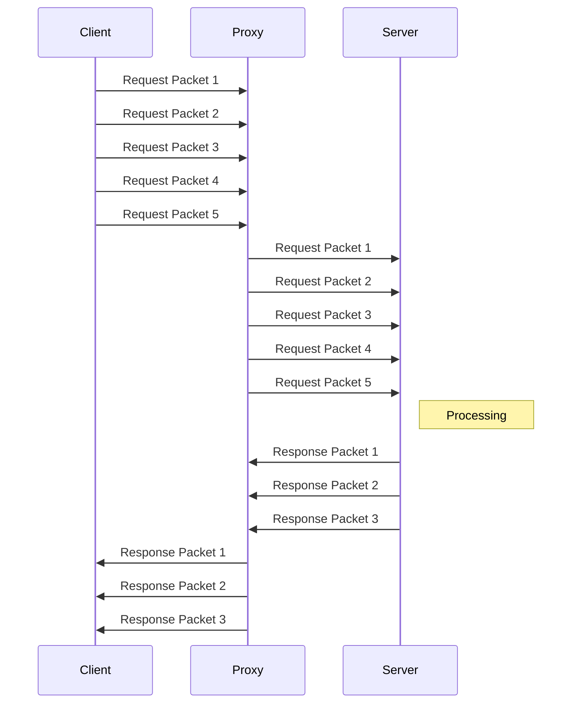
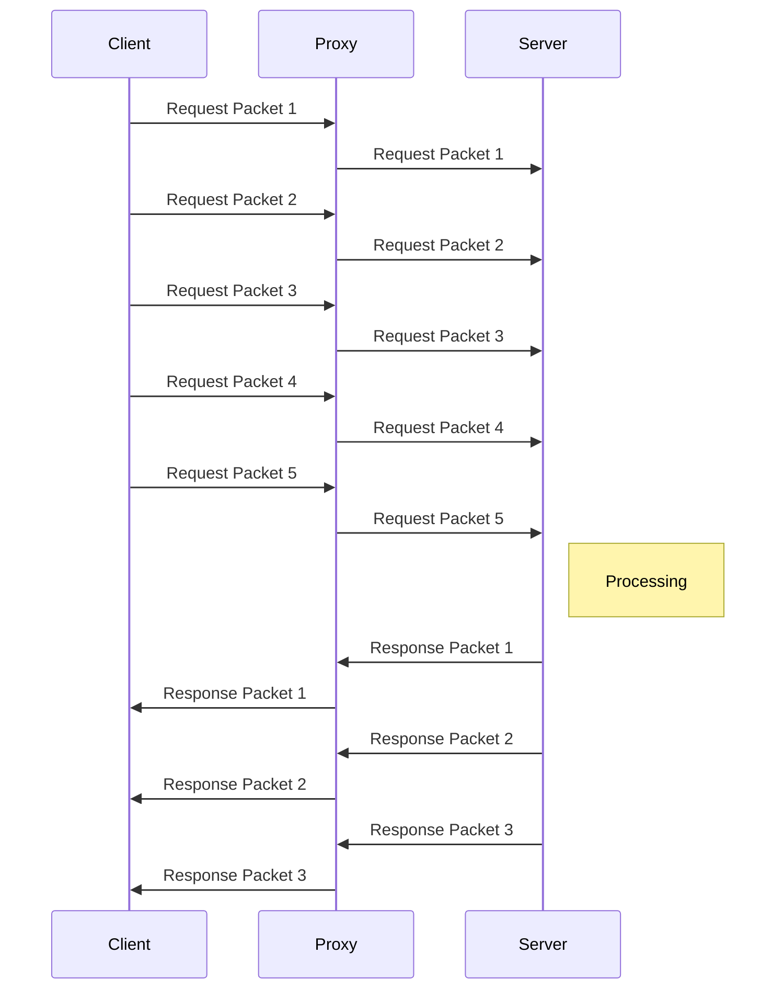

In a common [[proxies|proxy]], the server ends up not knowing the originating client. We can  however, reverse this situation, and make the [[client]] unaware of the destination [[server]]. This has several use cases, many prevalent in [[Microservices]] architectures, such as:

* Caching    
* [[Load Balancing]]
* [[Ingress]]
* [[Software Techniques#Canary Deployments]]

    Ingress:
        Hey, you talk to me sir,  and if you wanna access the pictures api, it can route requests. 

As a reverse proxy , when receiving a [[TLS]] handshake request, we can choose to act in several ways. 

The first one is to respond to the client with the proxy's own [[certificate]] and TLS Parameters. This is called [[TLS Termination]].
This necessitates, however, that the [[private key]] and certificate be in the reverse proxy. This has some major concerns , since it gives the proxy the ability to crack the underlying contents, and enables it to act as a representative of the certificate holder. 

We can circunvent such concerns by making the reverse proxy transparently forward the TLS request without decrypting its content. This makes it operate just like a L4 Proxy.  This is called [[TLS Passthrough]]. 

It can continue routing [[encrypted]] requests by means of [[Server Name Indication]] [[expand]].

Since a Layer 7 proxy needs to understand the request, it cannot forward the packets as they come. It has to receive and acknowledging each one, and internally assemble the request in order to be able to do its decisions. 

It can, afterwards, stablish an tcp request to the downstream server and send the packets. 
    
* Its very common to "[[tamper]]" the requests when doing this, such as adding requests headers. 

* Since its operating at Layer 7 via http - a stateless protocol - its very possible that further requests stabish a new tcp connection with the same server, or even other servers. 

A Layer 4 proxy doesn't need to wait to assembly the whole request:  it can immediatelly send the packets to the downstream server.

Additionally, further requests re-utilize the same previous stablished tcp connection: TCP is NOT a stateless protocol. 

This means that Layer 4 proxies can be faster and more [[efficient]] than its conterparts.  This also means less [[flexibility]]:We can't do intelligent things while proxying blindly. 

# Tools:
    
* [[HAProxy]]
* [[Envoy]]
* [[Nginx]]
* [[Istio]]
* Linkerd
* Caddy

___

References

* https://www.youtube.com/watch?v=iLHhL-vAPqo
* https://www.youtube.com/watch?v=SqqrOspasag 
* https://www.youtube.com/watch?v=ylkAc9wmKhc

