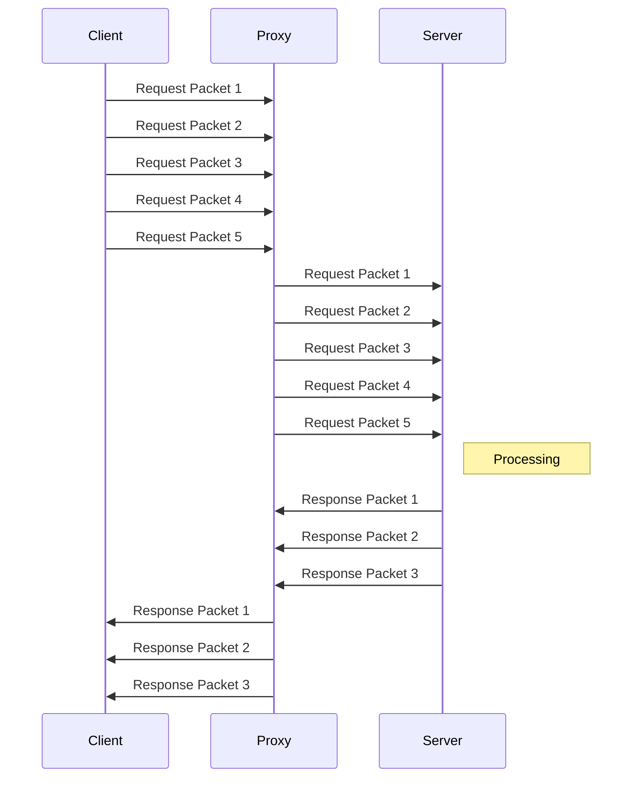
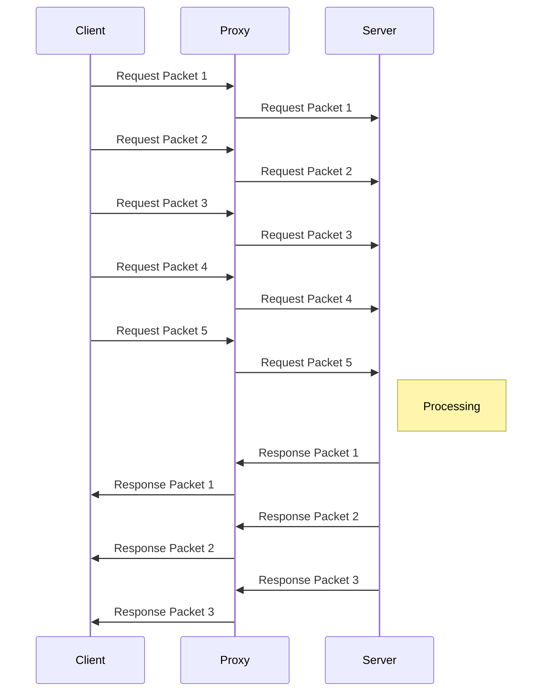

# Reverse Proxies

In a common [[ proxy ]], the server ends up not knowing the originating client. We can, however, invert this situation, making [[client]] unaware of the destination [[server]].

This has several use cases, many prevalent in [[Microservices]] and [[Distributed]] architectures, such as:

* Caching
* [[Load Balancing]]
* [[Ingress]]
* [[Canary Deployments]]
* Ingress:
  * Hey, you talk to me sir,  and if you wanna access the pictures API, I can route requests.

As a reverse proxy, when receiving a [[TLS]] handshake request, we can choose to act in several ways.

The first one is to respond to the client with the proxy's own [[certificate]] and TLS Parameters. This is called [[TLS Termination]]. This necessitates, however, that the [[private key]] and certificate be in the reverse proxy. This raises major concerns:

* The proxy has the ability to [[crack]] the underlying contents
* The proxy can act as a representative of the certificate holder.

We can circumvent such concerns by making the reverse proxy transparently forward the TLS request without decrypting its content. This makes it operate just like a [[Layer 4 Proxy]].
> This is called [[TLS Passthrough]].

It can continue routing [[encrypted]] requests by means of [[Server Name Indication]] [[expand]].

A [[Layer 7 proxy]] needs to understand the request, making it incapable of forwarding the packets as they come. It has to receive and acknowledge each one, and internally assemble the request to do its decisions.

It can, afterward, establish a TCP request to the downstream server and send the packets.

* It is very common to "[[tamper]]" the requests when doing this, e.g add requests [[headers]].

* Since it is operating at Layer 7 via http - a stateless protocol - it is very possible that further requests establish a new TCP connection with the same server, or even other servers.

A Layer 4 proxy doesn't need to wait to assemble the whole request:  it can immediately send the packets to the downstream server.

Additionally, further requests re-utilize the same previously established TCP connection: TCP is NOT a stateless protocol.

This means that Layer 4 proxies can be faster and more [[efficient]] than their counterparts.  This also means less [[flexibility]]: We can't do intelligent things while proxying blindly.

> This is a realization of the [[ Flexibility Tradeoff ]]

___

## Tools

* [[HAProxy]]
* [[Envoy]]
* [[Nginx]]
* [[Istio]]
* [[Linkerd]]
* [[Caddy]]

___

## References

* <https://www.youtube.com/watch?v=iLHhL-vAPqo>
* <https://www.youtube.com/watch?v=SqqrOspasag>
* <https://www.youtube.com/watch?v=ylkAc9wmKhc>
