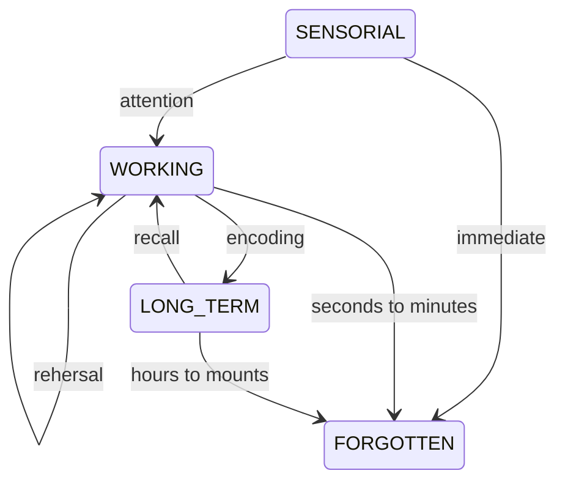

# InformationProcessingTheory

The consolidation of long term memory happens through a process,
simplified below:

Of note, two practices are most important:

1. [[Encoding]]
2. [[Recall]], which is impacted by the way it was encoded.

Notice also that [[Forgetting]] is *not* a passive process.
Your brain tries to actively forget everything it does not use.

## References

- [Study More Efficiently With These 2 Basic Steps - YouTube](https://www.youtube.com/watch?v=VcT8puLpNKA\&t=28s)

- [The PROBLEM with Active Recall and Spaced Repetition (Truth Behind Studying Smarter) - YouTube](https://www.youtube.com/watch?v=--Hu2w0s72Y)

- [Cognitive Load Just KILLED Active Recall (How I Used ENCODING At Medical School) - YouTube](https://www.youtube.com/watch?v=bk4718yjJM4)
