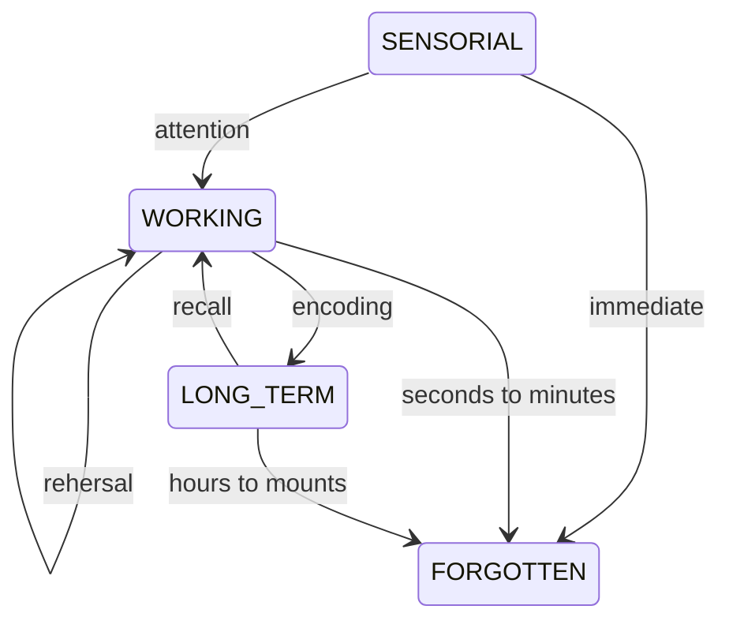

# TheLearningLifecycle

Before getting into what learning *is*, it is interesting to dele into what we're trying to *achieve* through learning.

## LearningOutcomes

There are several kinds of classifications and taxonomies for learning and knowledge. E.g.

[[BloomTaxonomy]] tries to create a set of language for discussing learning
outcomes.  It divides learning into three low levels and three high level tiers
of learning. Each tier is defined by the way in which the student uses the
knowledge.

For example, In the first tier, the student should be able to recite
back fact-based knowledge, without necessarily understanding it.
At higher levels, he should be able to contrast, and even synthesize new information.

[[SoloTaxonomy]] creates a set of tier that is not based in outcomes, but in
relationships, and in the way that the student is able to grasp the relationship
between the different concepts.

Between all these systems, there is a concordance that - Isolated stuff belongs
to lower levels of understanding, while higher levels of understanding require
the grasp of a more interconnected reality. [^1]

## LearningProcess

The consolidation of long term memory happens through a process, as described by [[InformationProcessingTheory]]



Above is a simplified model on how learning work.
Of note, two practices are most important:

1. [[Encoding]], which does not happen without [[CognitiveLoadTheory | CognitiveLoad]]
2. [[Recall]], which is impacted by the way it was encoded.

Notice also that [[Forgetting]] is *not* a passive process.
Your brain tries to actively forget everything it does not use.

## Encoding

Encoding is very important, and does not happen without sufficient `cognitive load`.
This is why `studying != learning` [^2]

There are things that are changeable in the studying process,
such as reading fast, slow, making notes, audio, video that are capable of
inducing more cognitive load.

These are usually referred to as [[ActiveLearning]] Techniques.

Encoding \~ `cognitive Load` , up to a certain point.

```ascii
    ENCODING
    ┼    ╭───────
    ┤   ╭╯
    ┤  ╭╯
    ┤ ╭╯
    ┤╭╯
    ┼╯----------- COGNITIVE LOAD
```

## CognitiveLoading

[[CognitiveLoadTheory]] is a theory on how encoding and retrieval works.  [^3]
It is focused on the `working memory`, and states that the encoding process
creates overarching mental models inside the long term memory, called `Schemas`.

These are loaded into the working memory, through retrieval, and encoding is
done through associating new bits of information, to the already known bits of
the schema.

Cognitive load can be split into three kinds:

1. Intrinsic

Simple topics require little while complex topics require large amounts of space.
Total complexity is fixed, but [[Chunking]] can be used to reduce those into
manageable sizes and to speed up how fast the brains picks it up.

> [[Storage]] size

2. Extraneous

Information not relevant, such as method used and channel noisiness.

Reducing extraneous load is the primary role of teachers, whether they know it or not.

> [[SplitAttentionEffect]], [[RedundancyEffect]]

3. Germane

Creating a schema for new info, and integrating it into existing knowledge

`in order to learn more effectively, the limits of the working memory must be respected, and few pieces of information must be put at a time`.

Optimization

- Activate Prior Knowledge
- Simplify difficulty
  [[ModalityEffect]]
- reduce irrelevant info
  [[LearningScaffolding]]
- organize and link into existing knowledge
  [[Priming]]
  [[Spacing]]

## References

[^1]: [Study More Efficiently With These 2 Basic Steps - YouTube](https://www.youtube.com/watch?v=VcT8puLpNKA\&t=28s)

[^2]: [The PROBLEM with Active Recall and Spaced Repetition (Truth Behind Studying Smarter) - YouTube](https://www.youtube.com/watch?v=--Hu2w0s72Y)

[^3]: [Cognitive Load Just KILLED Active Recall (How I Used ENCODING At Medical School) - YouTube](https://www.youtube.com/watch?v=bk4718yjJM4)
